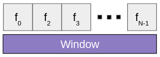
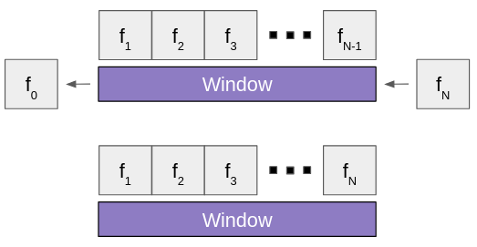
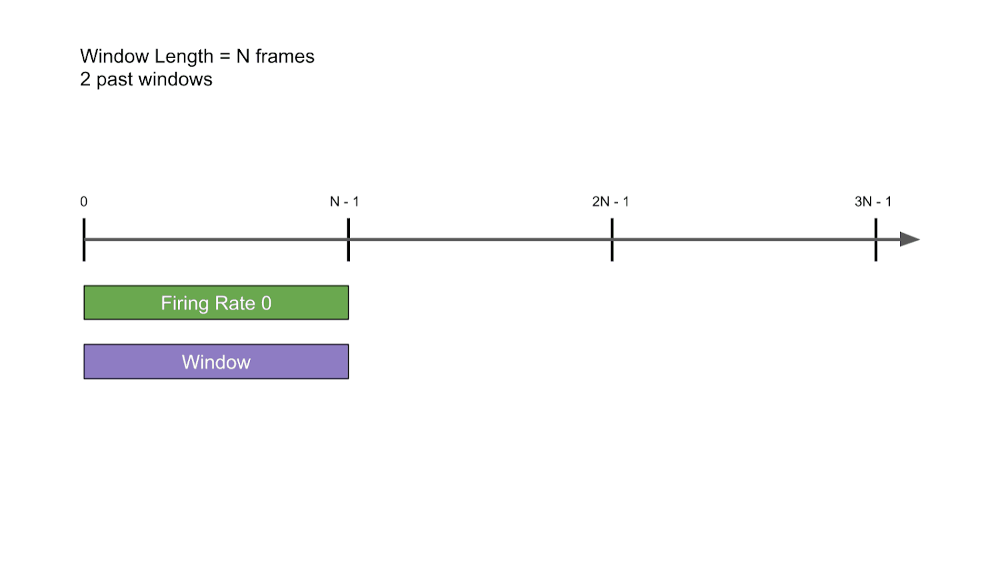

.. include:: links.rst

``ChannelWindow``
=================

Overview 
^^^^^^^^

|ChannelWindow|_ stores a sequence of MaxOne/Two data frames so they can be 
all be processed together, as opposed to examing individual frames. A 
|ChannelWindow|_ of length ``N`` is initialized with the first ``N`` frames of 
the experiment.

| 
Useful chip activity data can be extracted from the window, such as the firing 
rate and the average x-position of the spikes. For each new frame added to the 
window, the oldest frame is removed.

| 
If specified, the |ChannelWindow|_ will save the data for ``P`` number of *past 
windows*. Data is saved for each *unique* window, which means that none of the 
frames in the current window are in the most recently saved window. 

For example, 
if the window is 200 frames long, then frames 0 through 199 are saved as the 
first past window. The next window that will be saved will contain frames 200 
through 299, since that is the first set of frames where there is no overlap 
with the most recently saved window.

Similar to how |ChannelWindow|_ handles frames, when there are ``P`` past
windows and a new window is saved, the oldest window will be removed.

Currently, the only window data that is saved is the firing rate, but this can 
easily be extended.

Example:

.. container:: toggle

    .. container:: header

        Step-by-Step
    
    This example assumes that ``P`` = 2, meaning that up to 2 past windows will 
    be saved. The first instance of the window is unique, so its firing rate is 
    saved.

    .. image:: images/past1.png
    |

    The window progresses.

    .. image:: images/past2.png
    |

    As soon as the window does not overlap with the most recently saved window, 
    its firing rate is saved.

    .. image:: images/past3.png
    |

    The window progresses.

    .. image:: images/past4.png
    |

    If there are ``P`` (2 in this case) past windows, then the oldest one is 
    removed whenever a new one is saved.

    .. image:: images/past5.png
|

|

|ChannelWindow|_ uses |ElectrodeMap|_ to filter out any unwanted frames; this 
behaviour is particularly helpful if there are multiple windows in an experiment,
where each window represents a different part of the chip. 

Members 
^^^^^^^

.. doxygenclass:: ChannelWindow
    :members: