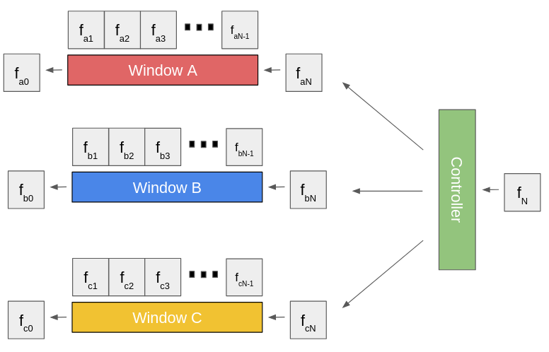

.. include:: links.rst

``Controller``
==============

Overview 
^^^^^^^^

The |Controller|_ class stores |ChannelWindow|_ objects as "buttons", allowing 
for the user to automatically organize, initialize, update, and access many windows at once. 
For actual button-like detection from the window activity, see the subclass |NES|_.

Members 
^^^^^^^

.. doxygenclass:: Controller
    :members: